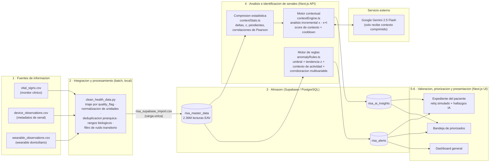

# Arquitectura Implementada — HealthSignal RISA

Este documento describe **únicamente la arquitectura realmente implementada** en el
prototipo. No incluye componentes futuros ni idealizados; las limitaciones y los
supuestos están declarados al final y en el README.

## 1. Vista general del flujo

Flujo exigido por el reto: *Fuentes → Integración/Procesamiento → Análisis →
Identificación de señales → Valoración/Priorización → Presentación*.

## 2. Componentes y responsabilidades

| Capa | Componente | Qué hace | Dónde corre |
|---|---|---|---|
| Integración | `clean_health_data.py` | Unifica 3 fuentes heterogéneas al modelo EAV (`paciente, dispositivo, timestamp, variable, valor`), aplica las 5 etapas de limpieza y emite auditoría (`data_quality_audit.csv`, `flagged_transient_glitches.csv`) | Local, batch, una vez |
| Almacén | Supabase (PostgreSQL + PostgREST) | 3 tablas con RLS activo: lecturas, alertas, diagnósticos. La clave anónima solo lee; toda escritura exige la clave de servicio (solo servidor) | Cloud |
| Detección | `lib/anomalyRules.ts` | Motor determinístico de 2 etapas: detección por punto (umbral clínico + z de tendencia con piso de desviación absoluta) y priorización (score 0-100 → tier) con 5 patrones anti-falsas-alarmas | Servidor (tick global) y navegador (reloj por paciente) |
| Análisis contextual | `lib/contextStats.ts` + `lib/contextEngine.ts` | Comprime cada intervalo a estadísticas calculadas localmente; solo si el **score de contexto agregado** supera el umbral (40) y pasó el cooldown (6 h simuladas) se llama a la IA | Servidor |
| IA | `lib/gemini.ts` → Gemini 2.5 Flash | Recibe SOLO el contexto comprimido (~600 tokens: estadísticas + diagnóstico previo como memoria), nunca datos crudos. Salida JSON validada; los números mostrados en UI se inyectan desde el cálculo local, no del modelo | Servicio externo |
| Simulación | `GlobalSimulationContext` + `/api/simulate/tick` | Reproduce la ingesta en "tiempo simulado": barrido round-robin sobre los 1000 pacientes en lotes de 8, avanzando 10 h simuladas por visita, con presupuesto de máx. 2 análisis de IA por tick | Navegador (orquesta) + servidor (procesa) |
| Presentación | Next.js App Router | Dashboard, bandeja priorizada (ranking por tier máximo + score), directorio con estados derivados de datos reales, expediente con reloj anti-fuga-futura (`t ≤ t_sim`) | Navegador |

## 3. Decisiones de arquitectura relevantes al contexto latinoamericano

- **Fuentes no uniformes de fábrica:** las tres fuentes reales tienen esquemas,
  frecuencias (20 min el monitor, 30 min el wearable, 2 h la presión) y vocabularios
  distintos (`RR`/`SBP`/`DBP` vs códigos normalizados). El modelo EAV los unifica sin
  exigir que las fuentes cambien — patrón de **capa modular sobre sistemas existentes**.
- **Incorporar una fuente nueva no reescribe el sistema:** basta mapear sus columnas al
  EAV en el ETL; el motor de reglas, el análisis contextual y la UI no cambian (la
  lista de variables y umbrales vive en un solo módulo, `anomalyRules.ts` /
  `clinicalClusters.ts`).
- **La ausencia de datos es señal, no silencio:** el detector `DATA_GAP` alerta cuando
  una variable deja de reportar más de 3× su intervalo empírico — diseñado para
  conectividad intermitente en los puntos de captura.
- **Detección barata separada de IA costosa:** el motor de reglas es determinístico y
  corre en cualquier parte (incluso en el navegador del expediente); la IA solo se
  invoca cuando el contexto agregado cambió (score ≥ 40, cooldown, presupuesto por
  tick). El costo por análisis es fijo (~600 tokens) sin importar cuánto historial
  tenga el paciente, porque lo anterior viaja comprimido en el diagnóstico previo.
- **Anti-fuga temporal en dos puntos:** el ETL descarta lecturas de wearable
  sincronizadas antes de ser medidas (`sync_datetime >= timestamp`), y toda consulta de
  la simulación filtra `timestamp <= t_simulado`.

## 4. Qué NO tiene esta arquitectura (declaración honesta)

- **No hay componente edge físico ni IoT real:** las "fuentes" son los CSV del reto
  reproducidos en tiempo simulado. El procesamiento local del navegador (motor de
  reglas en el expediente) muestra el patrón edge-friendly, pero no hay hardware.
- **No hay interoperabilidad HL7/FHIR:** la integración es por mapeo de columnas al
  modelo EAV, no por estándar clínico.
- **No hay autenticación de usuarios** en la UI ni en los endpoints (hay RLS,
  validación de entrada y rate limiting; no hay login).
- **No hay cola offline ni sincronización diferida implementada:** si la escritura a
  Supabase falla, la alerta ya mostrada no se pierde en pantalla pero no se reintenta.
- **El rate limiting es en memoria y por instancia**, no distribuido.
