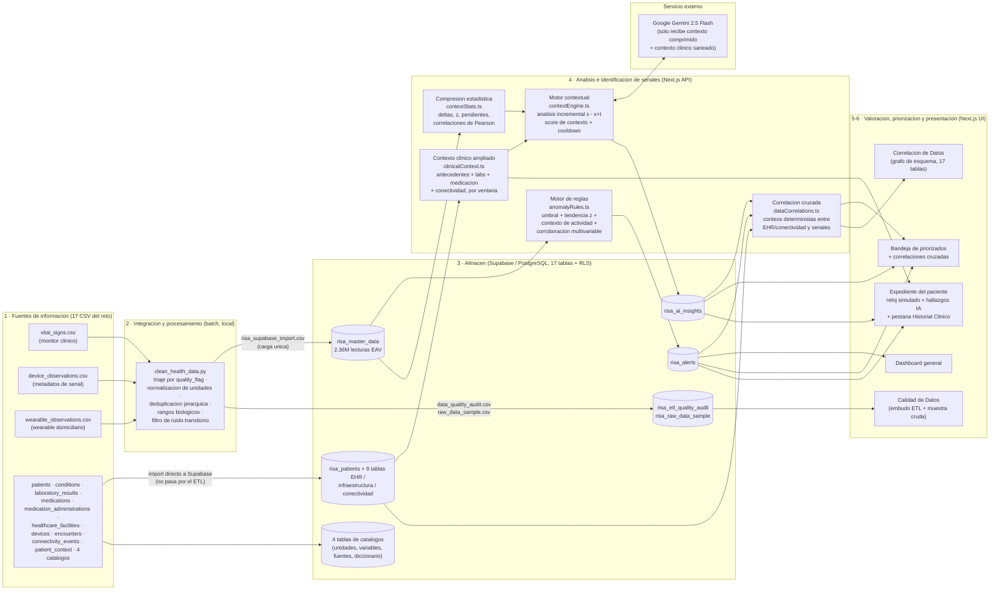

# Arquitectura Implementada — HealthSignal RISA

Este documento describe **únicamente la arquitectura realmente implementada** en el
prototipo. No incluye componentes futuros ni idealizados; las limitaciones y los
supuestos están declarados al final y en el README.

## 1. Vista general del flujo

Flujo exigido por el reto: *Fuentes → Integración/Procesamiento → Análisis →
Identificación de señales → Valoración/Priorización → Presentación*.

## 2. Componentes y responsabilidades

| Capa | Componente | Qué hace | Dónde corre |
|---|---|---|---|
| Integración | `clean_health_data.py` | Unifica 3 fuentes de telemetría heterogéneas al modelo EAV (`paciente, dispositivo, timestamp, variable, valor`), aplica las 5 etapas de limpieza y emite auditoría (`data_quality_audit.csv`, `raw_data_sample.csv`, `flagged_transient_glitches.csv`) | Local, batch, una vez |
| Carga EHR/catálogos | Import directo (Table Editor) + `scripts/load-etl-audit.mjs` | Las 14 fuentes restantes (antecedentes, laboratorios, medicación, infraestructura, conectividad, catálogos) no pasan por el ETL: se importan tal cual a su tabla homónima. El script sí carga las 2 tablas de auditoría, con clave de servicio obligatoria | Local, una vez |
| Almacén | Supabase (PostgreSQL + PostgREST) | 17 tablas con RLS activo (lecturas, alertas, diagnósticos, EHR, infraestructura, conectividad, catálogos, auditoría). La clave anónima solo lee; toda escritura exige la clave de servicio (solo servidor) | Cloud |
| Detección | `lib/anomalyRules.ts` | Motor determinístico de 2 etapas: detección por punto (umbral clínico + z de tendencia con piso de desviación absoluta) y priorización (score 0-100 → tier) con 5 patrones anti-falsas-alarmas | Servidor (tick global) y navegador (reloj por paciente) |
| Análisis contextual | `lib/contextStats.ts` + `lib/contextEngine.ts` | Comprime cada intervalo a estadísticas calculadas localmente; solo si el **score de contexto agregado** supera el umbral (40) y pasó el cooldown (6 h simuladas) se llama a la IA | Servidor |
| Contexto clínico | `lib/clinicalContext.ts` | Un único fetcher trae antecedentes activos, laboratorios/medicación del intervalo y eventos de conectividad, con dos ventanas distintas: la incremental (para la IA) y la "hacia atrás desde ahora" (para el expediente) | Servidor |
| Correlación cruzada | `lib/dataCorrelations.ts` | Cruza deterministamente conectividad, antecedentes y laboratorios contra las alertas/diagnósticos ya calculados; cada relación es un conteo con su denominador, no un coeficiente inventado | Servidor |
| Auditoría de calidad | `lib/dataQualityAudit.ts` | Sirve el resumen del embudo ETL y la muestra cruda paginada/filtrable desde `risa_etl_quality_audit` y `risa_raw_data_sample` | Servidor |
| IA | `lib/gemini.ts` → Gemini 2.5 Flash | Recibe SOLO el contexto comprimido + contexto clínico (~600 tokens: estadísticas, antecedentes/labs/meds del intervalo y diagnóstico previo como memoria), nunca datos crudos. La nota previa reinyectada viaja saneada y delimitada (`sanitizeForPrompt`, `<<<DATO>>>`) para mitigar inyección de prompt. Salida JSON validada; los números mostrados en UI se inyectan desde el cálculo local, no del modelo | Servicio externo |
| Simulación | `GlobalSimulationContext` + `/api/simulate/tick` | Reproduce la ingesta en "tiempo simulado": barrido round-robin sobre los 1000 pacientes en lotes de 8, avanzando 10 h simuladas por visita, con presupuesto de máx. 2 análisis de IA por tick | Navegador (orquesta) + servidor (procesa) |
| Presentación | Next.js App Router | Dashboard, bandeja priorizada (ranking por tier máximo + score, con correlaciones cruzadas embebidas), directorio con filtros demográficos y estados derivados de datos reales, expediente con reloj anti-fuga-futura (`t ≤ t_sim`) + pestaña Historial Clínico, panel de Calidad de Datos y panel de Correlación de Datos (con grafo interactivo del esquema) | Navegador |

## 3. Decisiones de arquitectura relevantes al contexto latinoamericano

- **Fuentes no uniformes de fábrica:** las tres fuentes de telemetría tienen esquemas,
  frecuencias (20 min el monitor, 30 min el wearable, 2 h la presión) y vocabularios
  distintos (`RR`/`SBP`/`DBP` vs códigos normalizados). El modelo EAV los unifica sin
  exigir que las fuentes cambien — patrón de **capa modular sobre sistemas existentes**.
- **Incorporar una fuente nueva no reescribe el sistema:** basta mapear sus columnas al
  EAV en el ETL; el motor de reglas, el análisis contextual y la UI no cambian (la
  lista de variables y umbrales vive en un solo módulo, `anomalyRules.ts` /
  `clinicalClusters.ts`). Las 14 fuentes EHR/infraestructura/catálogos siguieron el
  mismo principio en sentido inverso: se sumaron como tablas nuevas unidas por
  `patient_id` sin tocar el motor de reglas ni el ETL existente — solo se agregó un
  fetcher (`clinicalContext.ts`) que las consume.
- **La ausencia de datos es señal, no silencio:** el detector `DATA_GAP` alerta cuando
  una variable deja de reportar más de 3× su intervalo empírico — diseñado para
  conectividad intermitente en los puntos de captura. El nuevo cruce con
  `risa_connectivity_events` (`dataCorrelations.ts`) permite además distinguir, a nivel
  de panel, cuánto de ese silencio coincide con un incidente de red real.
- **Detección barata separada de IA costosa:** el motor de reglas es determinístico y
  corre en cualquier parte (incluso en el navegador del expediente); la IA solo se
  invoca cuando el contexto agregado cambió (score ≥ 40, cooldown, presupuesto por
  tick). El costo por análisis es fijo (~600 tokens) sin importar cuánto historial
  tenga el paciente, porque lo anterior viaja comprimido en el diagnóstico previo; el
  contexto clínico ampliado (antecedentes/labs/meds) se suma al mismo prompt solo
  cuando hay algo nuevo en el intervalo, sin inflar el costo en el caso común.
- **Anti-fuga temporal en dos puntos:** el ETL descarta lecturas de wearable
  sincronizadas antes de ser medidas (`sync_datetime >= timestamp`), y toda consulta de
  la simulación (incluida la del contexto clínico ampliado) filtra `timestamp /
  recorded_datetime <= t_simulado`.
- **Correlación como conteo, no como inferencia:** `dataCorrelations.ts` deliberadamente
  no calcula coeficientes estadísticos (correlación de Pearson, p-values) sobre EHR: la
  muestra de algunas categorías (ej. una condición poco frecuente) es demasiado chica
  para sostener esa inferencia, así que cada relación se expresa como un conteo con su
  denominador explícito — verificable a simple vista, no una caja negra estadística.
- **Contenido persistido tratado como no confiable:** la nota previa que la IA genera en
  una iteración se reinyecta como memoria en la siguiente; para que ese texto no pueda
  alterar el comportamiento del modelo, viaja saneado (`validation.ts#sanitizeForPrompt`)
  y encerrado en delimitadores explícitos que el prompt marca como dato, nunca como
  instrucción.

## 4. Qué NO tiene esta arquitectura (declaración honesta)

- **No hay componente edge físico ni IoT real:** las "fuentes" son los CSV del reto
  reproducidos en tiempo simulado. El procesamiento local del navegador (motor de
  reglas en el expediente) muestra el patrón edge-friendly, pero no hay hardware.
- **No hay interoperabilidad HL7/FHIR:** la integración es por mapeo de columnas al
  modelo EAV, no por estándar clínico.
- **No hay autenticación de usuarios** en la UI ni en los endpoints (hay RLS,
  validación de entrada y rate limiting; no hay login).
- **No hay cola offline ni sincronización diferida implementada:** si la escritura a
  Supabase falla, la alerta ya mostrada no se pierde en pantalla pero no se reintenta.
- **El rate limiting es en memoria y por instancia**, no distribuido.
- **La saneación anti-inyección de prompt es una mitigación, no una garantía:** reduce
  el riesgo de que texto generado por el propio modelo en un ciclo anterior altere su
  comportamiento en el siguiente, pero no reemplaza un sandbox de salida ni un filtro
  de contenido dedicado.
- **Las 14 fuentes EHR/infraestructura/catálogos se importan una sola vez, sin ETL
  propio:** a diferencia de la telemetría, no pasan por triaje de calidad ni
  deduplicación — se asume que llegan ya limpias del reto. Si una fuente real
  equivalente llegara con ruido, hoy no hay una etapa que lo filtre antes de la carga.
